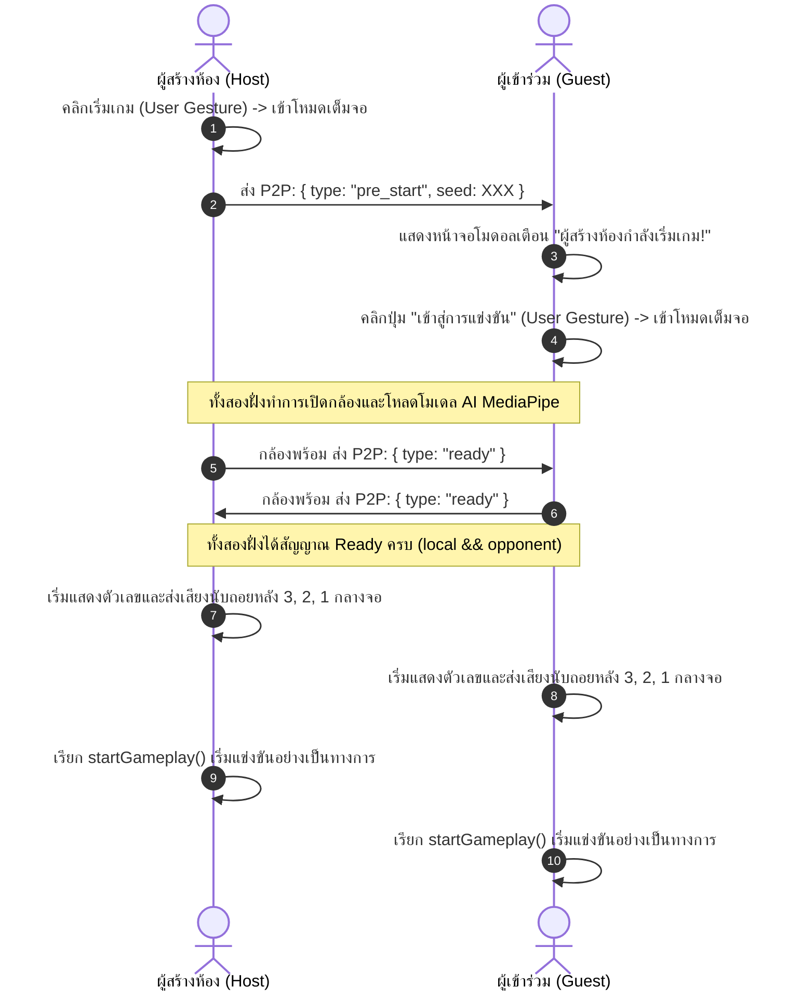

# Balloon Burst v3: AR Interactive P2P Educational Game
คู่มือการพัฒนาและการออกแบบระบบ (Developer Guide & Documentation)

ยินดีต้อนรับนักพัฒนาทุกท่านเข้าสู่ซอร์สโค้ดเกม **Balloon Burst v3** เกมแนวปฏิสัมพันธ์ผ่านกล้อง (Augmented Reality - AR) ที่ขับเคลื่อนด้วยปัญญาประดิษฐ์ตรวจจับมือและนิ้วชี้แบบเรียลไทม์ พร้อมโหมดท้าดวลออนไลน์แบบไร้เซิร์ฟเวอร์ (P2P)

เอกสารฉบับนี้จัดทำขึ้นเพื่อให้ผู้พัฒนาคนถัดไปสามารถทำความเข้าใจภาพรวม สถาปัตยกรรม เทคโนโลยี และตรรกะการทำงานของเกมได้อย่างรวดเร็วและละเอียดถี่ถ้วน

---

## 1. ภาพรวมของโปรเจกต์ (Project Review)

**Balloon Burst v3** เป็นสื่อการเรียนรู้อิเล็กทรอนิกส์ในรูปแบบเกมส์ (Educational Game) มีเป้าหมายในการพัฒนาทักษะทางวิชาการ เช่น การสะกดคำภาษาไทย (คำประวิสรรชนีย์), คำศัพท์ภาษาอังกฤษ (Verbs / Body Parts), คณิตศาสตร์ (สมการบวกเลข) และวิทยาศาสตร์ (ส่วนประกอบของพืช) 

### ฟังก์ชันหลักของตัวเกม:
*   **โหมดการเล่นสองแบบ:**
    *   **เล่นคนเดียว (Single Player):** ฝึกฝนสะสมคะแนนและวิเคราะห์คำศัพท์
    *   **เล่นแข่งกับเพื่อน (Online VS - P2P):** ท้าประลองกับผู้เล่นอีกคนผ่านระบบออนไลน์เรียลไทม์
*   **ควบคุมด้วยเทคโนโลยี AR (Hand Tracking):** ผู้เล่นใช้กล้องเว็บแคม ชูนิ้วชี้ขึ้นเพื่อเป็นตัวชี้เลเซอร์บนหน้าจอในการจิ้มเจาะลูกโป่ง หรือเลือกสลับไปใช้โหมดสัมผัสหน้าจอ/เมาส์ได้ตลอดเวลา
*   **ระบบแข่งขัน P2P สองกติกา:**
    *   **แย่งกันเจาะ (Share Mode):** มีลูกโป่งชุดเดียวกันลอยขึ้นมาตรงกลางจอ ผู้เล่นทั้งสองฝ่ายต้องแย่งกันเจาะเพื่อเก็บแต้ม ใครเจาะก่อนได้แต้ม อีกฝ่ายจะเห็นลูกโป่งนั้นแตกทันที
    *   **ต่างคนต่างเจาะ (Race Mode):** ต่างคนต่างเล่นในกระดานของตนเองเพื่อทำคะแนนแข่งกันภายในเวลาที่กำหนด โดยระบบจะซ่อนตัวชี้ตำแหน่งของอีกฝ่ายเพื่อไม่ให้รบกวนสายตา
*   **การตั้งค่าคำศัพท์และกติกา (Custom Word & Game Settings):** ระบบฟอร์มที่ปรับปรุงใหม่ให้สามารถเลือกเทมเพลตวิชาต่าง ๆ หรือกำหนดคำที่ถูกต้อง/คำที่ผิดด้วยตนเองผ่านช่องกรอกแบบพื้นที่ข้อความขนาดใหญ่ที่ปรับขนาดแนวตั้งได้สะดวก (Vertically Resizable Textareas)
*   **การเลือกและตรวจสอบกล้องเว็บแคม (Webcam Selection & Preview):** ระบบจัดการกล้องที่รองรับการดึงรายชื่อกล้องทั้งหมดที่เชื่อมต่ออยู่ ให้ผู้ใช้เลือกใช้งานและดูภาพสดพรีวิว (Live Preview) ก่อนเข้าเล่นเกม พร้อมจดจำตัวเลือกผ่านหน่วยความจำของบราวเซอร์
*   **แผงสถิติและวินิจฉัยเครือข่าย (Real-time Network Diagnostics Panel):** แผงข้อมูลการเชื่อมต่อ WebRTC ในห้องล็อบบี้ แสดงบทบาท (Role), สถานะของห้องเชื่อมต่อ, ค่าความหน่วงเครือข่ายไป-กลับ (RTT Ping Latency) ในหน่วยมิลลิวินาที, อัตราความถี่สัญญาณชีพ (Heartbeat), และจำนวนแพ็กเก็ตส่ง/รับ เพื่อช่วยในการตรวจสอบปัญหาอินเทอร์เน็ตระหว่างผู้เล่นสองคน

---

## 2. เทคโนโลยีที่ใช้งาน (Tech Stack)

ตัวเกมพัฒนาขึ้นโดยใช้เทคโนโลยีเว็บมาตรฐานระดับสูง (Vanilla Web Stack) เพื่อให้รันได้บนทุกอุปกรณ์ (Cross-Platform) ไม่ว่าจะเป็นเครื่องคอมพิวเตอร์, แท็บเล็ต, สมาร์ตโฟน หรือกระดานอัจฉริยะในห้องเรียน:

1.  **การแสดงผล (Rendering):** HTML5 Canvas API สำหรับการวาดออบเจกต์เกม, แอนิเมชัน และเอฟเฟกต์การสั่นของหน้าจอด้วยความเร็ว 60 FPS
2.  **การตกแต่ง (Styling):** Vanilla CSS3 ร่วมกับ Tailwind CSS (ผ่าน CDN) สำหรับหน้าต่างจัดการห้อง เมนูการควบคุม และเอฟเฟกต์แสงนีออนเรืองแสง รวมถึงการคำนวณขนาดความสูงหน้าจอแบบยืดหยุ่นสัมพันธ์ (Responsive Game Container) เพื่อป้องกันปุ่มหรือตัวเกมถูกตัดขาดบนหน้าจอขนาดต่าง ๆ
3.  **การตรวจจับมือ (AR AI Tracking):** 
    *   `MediaPipe Hands (v0.2)` และ `MediaPipe Camera Utilities` ประมวลผลภาพจากกล้องเว็บแคมเพื่อหาพิกัดปลายนิ้วชี้ (Landmark หมายเลข 8)
4.  **ระบบผู้เล่นหลายคน (Networking P2P):** 
    *   `PeerJS` (WebRTC DataChannels) ทำการส่งพิกัดตำแหน่งนิ้ว สถานะการกดปุ่ม ความพร้อม และการแตกของลูกโป่งระหว่างเครื่องผู้เล่นสองคนแบบตรงจุดต่อจุด (Peer-to-Peer) ปราศจากความล่าช้าจากเซิร์ฟเวอร์ส่วนกลาง
5.  **ระบบเสียง (Sound & Speech Engine):**
    *   `Web Audio API`: ทำการสร้างและสังเคราะห์คลื่นเสียงสัญญาณเอฟเฟกต์ขึ้นสดๆ (Real-time Synthesis) เช่น เสียงจิ้มลูกโป่งแตก และเสียงสัญญาณนับถอยหลัง โดยไม่ต้องมีการดาวน์โหลดไฟล์เสียง `.mp3` ภายนอก
    *   `Web Speech API (Text-to-Speech)`: ใช้สังเคราะห์เสียงอ่านออกเสียงคำศัพท์ภาษาไทยและภาษาอังกฤษที่ผู้เล่นเจาะได้ เพื่อส่งเสริมการเรียนรู้ด้านการฟังออกเสียงที่ถูกต้อง
6.  **ระบบตอบสนองด้วยการสั่น (Haptic Feedback):**
    *   ใช้ `Vibration API` (`navigator.vibrate`) เพื่อสร้างแรงสั่นสะเทือนตอบสนองทางกายภาพเมื่อผู้เล่นเจาะลูกโป่งแตกบนอุปกรณ์พกพา (สั่นสั้น 1 ครั้งเมื่อตอบถูก, สั่นเป็นจังหวะ 2 ครั้งเมื่อตอบผิด) เพิ่มมิติในการเล่นเกม
7.  **การบันทึกข้อมูลแบบโลคอล (Local Storage):**
    *   ใช้ `localStorage` ในการบันทึกและคงสภาพรหัสกล้องเว็บแคมตัวโปรดที่เลือกโดยผู้ใช้ (`preferredCameraId`) เพื่อไม่ให้ผู้เล่นต้องเสียเวลาเลือกกล้องใหม่ทุกครั้งที่มีการเปิดหน้าเว็บ
8.  **ข้อมูลคำศัพท์ (Data Layer):**
    *   ฐานข้อมูลคำศัพท์วิชาการเก็บไว้ในไฟล์ [js/data-ar-balloon-brust-game.js](./js/data-ar-balloon-brust-game.js) ในรูปแบบตัวแปร JavaScript ทั่วไป ช่วยหลีกเลี่ยงข้อจำกัดเรื่องระบบรักษาความปลอดภัยของเบราว์เซอร์ (CORS Block) ทำให้เกมสามารถเปิดเล่นและดึงคำศัพท์มาแสดงได้ทันที แม้เป็นการเปิดไฟล์ตรง ๆ แบบไม่มีเว็บเซิร์ฟเวอร์ (โปรโตคอล `file://`)
9.  **ระบบรักษาความปลอดภัยในการแชร์ห้อง (P2P Room Identifiers):**
    *   ระบบการตั้งรหัสห้องจับคู่จะสร้างเลขสุ่ม 4 หลักขึ้นมาให้โฮสต์แสดงผล ส่วนระบบเบื้องหลังจะใช้ชื่อห้องในฟอร์แมต `AR-BALLOON-xxxx` บนเซิร์ฟเวอร์ PeerJS สาธารณะ เพื่อหลีกเลี่ยงการเชื่อมต่อล้มเหลวหรือเกิดการสับสนพิกัดระหว่างผู้เล่นกลุ่มอื่น ๆ ในระบบเครือข่ายเดียวกัน
10. **ระบบรักษาสัญญาณและการวัดความหน่วง (Heartbeat & Latency Measurement):**
    *   ระบบกลไกการส่งสัญญาณควบคุมชีพจร (Heartbeat Loop) ในความถี่ทุก 3 วินาที เพื่อคอยคำนวณหาค่าความล่าช้าสะสมไปกลับ (RTT Ping) และใช้ตรวจเช็คว่าคู่แข่งขาดการติดต่อหรือไม่ หากมีการขาดการติดต่อนานเกิน 15 วินาที ระบบจะดึงผู้เล่นออกจากเกมอย่างปลอดภัยโดยไม่หลุดจากการแสดงผลแบบเต็มจอ (Fullscreen)

---

## 3. โครงสร้างโฟลเดอร์ (Folder Structure)

โค้ดของเกมได้รับการแยกส่วน (Decoupling) ตามหลักการของ **Clean Architecture** เพื่อป้องกันการปะปนกันของระดับการแสดงผล (UI), ตรรกะของเกม (Core Logic) และบริการการเชื่อมต่อภายนอก (Infrastructure) ดังนี้:

```text
games/ar-balloon-brust-game/
├── index.html        # UI & DOM Layout: เก็บโครงสร้างปุ่ม หน้าต่างท้าทาย และเฟรมวิดีโอ
├── style.css         # Styling Layer: สไตล์การเร่งกราฟิกคีย์เฟรม แอนิเมชัน และการซูมตัวเลข
└── js/
    ├── state.js      # Domain State: จุดรวมตัวแปรสถานะทั้งหมดของเกม และพิกัดเป้าหมาย
    ├── data-ar-balloon-brust-game.js # Data Layer: ไฟล์เก็บข้อมูลเทมเพลตคำศัพท์แบบ JS (หลีกเลี่ยง CORS)
    ├── audio.js      # Infrastructure: บริการสังเคราะห์เสียงเอฟเฟกต์ (Audio Synth) และออกเสียงคำศัพท์ (TTS)
    ├── entities.js   # Domain Entities: โมเดลคลาส Balloon, Particle, TextParticle และบ่อพักตัวแปร (Pools)
    ├── network.js    # Infrastructure: การจัดการ P2P PeerJS, การตอบรับข้อความ และตรรกะการหลุดการเชื่อมต่อ
    ├── camera.js     # Infrastructure: ตรรกะควบคุมกล้องและตัวจับตำแหน่งกระดูกนิ้ว MediaPipe Hands
    ├── game.js       # Use Cases: ลูปหลักอัปเดตตำแหน่งวาดเฟรม (Game Loop), ตรรกะตรวจสอบการชน และการนับถอยหลัง
    └── main.js       # Interface Adapters: การเชื่อมโยงปุ่มเหตุการณ์ UI, การจัดการหน้าจอ และการโหลดคำศัพท์จากไฟล์ข้อมูล
```

### รายละเอียดโครงสร้างไฟล์ภายใต้ `./` :
*   [index.html](./index.html) - UI & DOM Layout
*   [style.css](./style.css) - Styling Layer
*   [js/state.js](./js/state.js) - Domain State
*   [js/data-ar-balloon-brust-game.js](./js/data-ar-balloon-brust-game.js) - Word Database File
*   [js/audio.js](./js/audio.js) - Audio Service
*   [js/entities.js](./js/entities.js) - Domain Entities
*   [js/network.js](./js/network.js) - P2P Network Service
*   [js/camera.js](./js/camera.js) - Camera & AI Service
*   [js/game.js](./js/game.js) - Core Game Engine
*   [js/main.js](./js/main.js) - Presentation Layer

### ลำดับการโหลดสคริปต์ใน [index.html](./index.html):
```html
<script src="js/state.js"></script>     <!-- 1. ประกาศตัวแปรทั้งหมดเพื่อสร้าง Global Scope -->
<script src="js/data-ar-balloon-brust-game.js"></script> <!-- 2. โหลดฐานข้อมูลคำศัพท์เข้าระบบ -->
<script src="js/audio.js"></script>     <!-- 3. โหลดระบบเสียง -->
<script src="js/entities.js"></script>  <!-- 4. โหลดคลาสลูกโป่งและอนุภาค (ขึ้นอยู่กับ state และ audio) -->
<script src="js/network.js"></script>   <!-- 5. โหลดระบบออนไลน์ P2P (ขึ้นอยู่กับ state และ game) -->
<script src="js/camera.js"></script>    <!-- 6. โหลดระบบ AI กล้อง -->
<script src="js/game.js"></script>      <!-- 7. โหลดตรรกะเกมลูปหลัก (ขึ้นอยู่กับไฟล์ก่อนหน้าทั้งหมด) -->
<script src="js/main.js"></script>      <!-- 8. จุดเริ่มต้นระบบ ผูกปุ่มกด และเริ่มดึงข้อมูลคำศัพท์ -->
```

---

## 4. หลักการออกแบบเกมและการปรับปรุงประสิทธิภาพ (Game Design & Optimization)

ในการพัฒนาระบบโต้ตอบเรียลไทม์ผ่านกล้อง (Interactive AR) ร่วมกับการเชื่อมต่อออนไลน์แบบคู่ขนาน มีความเสี่ยงที่จะเกิดปัญหาคอขวดด้านประสิทธิภาพสูง โค้ดชุดนี้จึงถูกออกแบบมาโดยใช้หลักการสำคัญดังนี้:

### A. ระบบรีไซเคิลหน่วยความจำ (Object Pooling)
ในเกมประเภทที่มีการเกิดขึ้นและทำลายไปของออบเจกต์จำนวนมาก เช่น ลูกโป่ง, เศษกระจายเวลาแตก (Particles), และตัวเลขคะแนนลอยขึ้น (TextParticles) หากทำการ `new` ตัวแปรขึ้นมาเรื่อยๆ จะทำให้อุปกรณ์ช้าลงจากจังหวะที่เบราว์เซอร์ทำความสะอาดหน่วยความจำ (Garbage Collection Thrashing)
*   **แนวทางแก้ไข:** สร้างบ่อพักตัวแปร `balloonPool`, `particlePool`, และ `textParticlePool`
*   เมื่อออบเจกต์ทำหน้าที่เสร็จสิ้น (เช่น แตก หรือ ลอยหลุดหน้าจอ) ระบบจะไม่ลบออกจากหน่วยความจำ แต่จะทำการดึงเก็บเข้าบ่อพัก (Pool) และเมื่อต้องการใช้ออบเจกต์ใหม่ จะดึงค่าเดิมขึ้นมารีเซ็ตข้อมูลผ่านคำสั่ง `.init()` แทนการจองหน่วยความจำใหม่

### B. การวนลบข้อมูลความเร็วสูง (Swap-with-last Array Removal)
เดิมทีการลบไอเทมออกจากอาเรย์กลางลูปมักใช้ตรรกะ `.splice(index, 1)` ซึ่งทำให้สมาชิกในอาเรย์ตำแหน่งถัดไปทั้งหมดต้องเลื่อนตำแหน่งในหน่วยความจำ (การทำงานระดับ $O(N)$)
*   **แนวทางแก้ไข:** ใช้ตรรกะ **Swap-with-last** ร่วมกับการวนลูปลดตัวลงจากท้ายแถว (`for (let i = length-1; i >= 0; i--)`)
*   หากออบเจกต์ที่ดัชนี `i` ต้องถูกทำลาย ระบบจะนำออบเจกต์ที่อยู่ ณ ตำแหน่งท้ายสุดของอาเรย์มาเขียนทับที่ตำแหน่ง `i` ทันที จากนั้นสั่ง `.pop()` สมาชิกตัวสุดท้ายออก ซึ่งเป็นคำสั่งที่ทำงานเร็วที่สุดใน JavaScript (การทำงานระดับ $O(1)$) และเนื่องจากเป็นการวนลูปถอยหลัง สมาชิกที่สลับเข้ามาใหม่นี้จึงไม่ถูกนำมาประมวลผลซ้ำในเฟรมปัจจุบัน

### C. การคุมจังหวะส่งภาพตรวจจับ (AI Processing Throttling)
การส่งภาพเว็บแคมความละเอียดสูงให้โมเดล AI MediaPipe ประมวลผลในทุกๆ เฟรมของการเรนเดอร์ (60 FPS) จะส่งผลให้ CPU/GPU ทำงานหนักเกินไปและเกิดอาการเครื่องร้อนจัด
*   **แนวทางแก้ไข:** เพิ่มตัวแปรหน่วงเวลา `DETECTION_THROTTLE_MS = 50` ภายในคำสั่งสตรีมวิดีโอ เพื่อจำกัดการประมวลผลตรวจจับมือให้อยู่ที่ 20 FPS ซึ่งเพียงพอต่อความลื่นไหลในการเล็งเป้า และลดปริมาณความร้อนของอุปกรณ์ไปได้มากกว่า 60%

### D. การหน่วงความเคลื่อนไหวตัวชี้ออนไลน์ (Network Pointer Interpolation - Lerp)
พิกัดนิ้วชี้ของผู้เล่นฝั่งตรงข้ามจะถูกส่งมาทุกๆ 50ms (ตามจังหวะประมวลผล AI) ซึ่งทำให้ภาพวงกลมตัวชี้ขยับกระตุกเนื่องจากความหน่วงของการส่งข้อมูลทางเครือข่าย (Network Jitter)
*   **แนวทางแก้ไข:** แยกตัวแปรพิกัดออกเป็น `opponentTargetPointer` (พิกัดจริงที่รับมาล่าสุด) และ `opponentPointer` (พิกัดที่ใช้วาดภาพบน Canvas)
*   ในทุกๆ เฟรมเรนเดอร์ จะใช้ตรรกะ **Linear Interpolation (Lerp)** แบบอ้างอิงความต่างเวลา (Frame-rate Independent) ดึงพิกัดวาดภาพเข้าใกล้พิกัดเครือข่ายทีละน้อย:
    $$\text{pos}_{\text{render}} = \text{pos}_{\text{render}} + (\text{pos}_{\text{target}} - \text{pos}_{\text{render}}) \times (1 - (1 - f)^{\Delta t})$$
    ทำให้การเคลื่อนไหวของวงแหวนอีกฝ่ายขยับนุ่มนวลและลื่นไหลไร้รอยต่อ

### E. การสุ่มคำศัพท์ที่สอดคล้องกัน (Deterministic Seeded Random)
ในโหมดแข่งออนไลน์ หากลูกโป่งของทั้งสองฝั่งแสดงคำศัพท์ต่างกัน หรือลอยขึ้นมาในพิกัดที่ไม่เท่ากัน จะเกิดความไม่ยุติธรรมในการแข่งขัน
*   **แนวทางแก้ไข:** ใช้ขั้นตอนวิธีสุ่มแบบ **Mulberry32 Generator** ซึ่งอ้างอิงค่าเริ่มต้นของการสุ่มร่วมกัน (Seed)
*   ก่อนเริ่มเกมโฮสต์จะสุ่มสร้างรหัส Seed และส่งสัญญาณไปแชร์กับเกสต์ ทำให้การคำนวณสุ่มสี พิกัด ความเร็ว และคำศัพท์วิชาการที่ลอยขึ้นมา มีลำดับและตำแหน่งที่ตรงกันทั้งสองหน้าจอ 100%

### F. ระบบตรวจสอบสถานะการเชื่อมต่อเรียลไทม์ (WebRTC Heartbeat & Latency Diagnostics)
เพื่อป้องกันปัญหาผู้เล่นฝ่ายใดฝ่ายหนึ่งขาดการติดต่อโดยไม่รู้ตัว (Silent Disconnection) หรือประสบปัญหาความหน่วงสะสมสูง ระบบจึงออกแบบแผงวินิจฉัยและควบคุมชีพจรเครือข่ายดังนี้
*   **การวัดค่า Latency (RTT):** มีการจัดส่งแพ็กเก็ตชนิด `ping` พร้อมประทับเวลา (`Date.now()`) จากโฮสต์ไปยังเกสต์ในทุกๆ 3 วินาที เมื่ออีกฝ่ายได้รับสัญญาณจะทำการตอบกลับข้อความ `pong` พร้อมส่งพิกัดเวลากลับมาทันที เพื่อใช้คำนวณหาระยะเวลาไป-กลับ (Round-Trip Time) และแสดงผลบนหน้าจอให้เห็นเป็นตัวเลข ms แบบเรียลไทม์
*   **การตรวจเช็คคู่แข่งหลุด (Opponent Timeout Check):** หากค่าความต่างของเวลาจากสัญญาณชีพล่าสุด (`lastOpponentHeartbeatTime`) ห่างเกินกว่า 15 วินาที หรือสถานะ `networkConnection.open` เป็นเท็จ ระบบจะถือว่าการเชื่อมต่อขาดหาย และจะเรียกชุดคำสั่ง `handleOpponentDisconnect()` เพื่อนำผู้เล่นกลับสู่หน้าห้องเตรียมพร้อมอย่างเรียลไทม์โดยไม่มีการปิดการทำงานของระบบกล้องเว็บแคมหรือบังคับออกจากการแสดงผลเต็มจอ (Fullscreen)
*   **การประวิงเวลาเชื่อมต่อ (Delayed Heartbeat):** ระบบจะรอให้ผ่านพ้นเหตุการณ์การเปิดช่องสัญญาณ (`open` event) ก่อนเสมอจึงจะทำการเริ่มลูปรักษาสัญญาณชีพ เพื่อขจัดปัญหาความสับสนในเฟสเตรียมการเชื่อมต่อเริ่มต้น

### G. ระบบจัดการกล้องเว็บแคมหลายตัวและการบันทึกค่าถาวร (Webcam Enumeration & Preference Persistence)
เนื่องจากสภาพแวดล้อมของผู้ใช้งานบางห้องเรียนหรือบนคอมพิวเตอร์แบบตั้งโต๊ะอาจมีการติดตั้งกล้องหลายตัว (เช่น กล้องหน้าโน้ตบุ๊ก และกล้องพกพาตัวที่สองผ่าน USB) ระบบจึงรองรับการปรับเปลี่ยนดังนี้
*   **การตรวจหาอุปกรณ์อัตโนมัติ (Camera Device Enumeration):** ใช้ `navigator.mediaDevices.enumerateDevices()` ฟิลเตอร์คัดเลือกกล้องที่เป็น `videoinput` ทั้งหมด และนำชื่ออุปกรณ์ (`device.label`) มาแสดงผลในช่องตัวเลือก Dropdown
*   **การจำค่าระดับเบราว์เซอร์ (LocalStorage Persistence):** ค่าอุปกรณ์กล้องที่ผู้เล่นเลือกจะถูกบันทึกอย่างถาวรลงใน `localStorage` ด้วยคีย์ `preferredCameraId` เมื่อเข้าหน้าเว็บใหม่ในครั้งถัดไป ระบบจะหยิบยกการเชื่อมต่อกับกล้องตัวนี้เป็นลำดับแรกโดยอัตโนมัติ
*   **หน้าจอพรีวิวภาพสดแบบจำกัดขอบเขต (Isolated Live Preview):** ในหน้าต่างการตั้งค่ากล้อง มีการสร้างแทร็กสตรีมกล้องขนาดเล็กแยกต่างหากบนตัวแปร `previewStream` วาดลงบน `<video id="cameraPreviewVideo">` เพื่อทดสอบภาพก่อนเริ่มเล่นจริง และเมื่อปิดหน้าต่างลง ระบบจะเรียกใช้วงจรการทำลายแทร็ก (`previewStream.getTracks().forEach(track => track.stop())`) เพื่อปลดปล่อยสิทธิ์การครอบครองกล้องและประหยัดการใช้งาน CPU/GPU ของเครื่องในทันที

---

## 5. ตรรกะการทำงานและลำดับขั้นตอนโค้ดโดยละเอียด (Code Workflow)

### A. ขั้นตอนการเริ่มแข่งขันและขอสิทธิ์ Fullscreen (Startup Handshake)
เนื่องจากนโยบายความปลอดภัยของบราวเซอร์ยุคใหม่จะอนุญาตให้ใช้โหมดเต็มจอ (Fullscreen) เฉพาะเหตุการณ์ที่เกิดขึ้นจากการคลิกโดยตรงของผู้ใช้ (User Gesture) เท่านั้น ระบบจับคู่จึงทำงานเรียงตามลำดับดังนี้:



### B. วงจรการทำงานหลักของเกม (Game Loop Cycle)
ฟังก์ชัน `gameLoop(timestamp)` ในไฟล์ [js/game.js](./js/game.js#L115) ทำงานแบบวนซ้ำไม่รู้จบผ่าน `requestAnimationFrame` โดยมีขั้นตอนการทำงานในหนึ่งเฟรมดังนี้:

1.  **คำนวณ Delta Time (dt):** หาค่าระยะห่างของเวลาจากเฟรมก่อนหน้าเพื่อนำมาคูณเพิ่มความเร็วออบเจกต์ ช่วยให้ลูกโป่งลอยด้วยความเร็วคงที่แม้เครื่องจะเกิดอาการเฟรมเรตตก
2.  **ปรับตำแหน่ง Pointer (Smooth Lerp):** ขยับตัวชี้ของเราและตัวชี้คู่แข่งผ่านสมการ Lerp เข้าหาตำแหน่งเป้าหมาย
3.  **เคลียร์และวาดพื้นหลัง:** เคลียร์ผืนภาพวาด Canvas ดึงภาพกล้องเว็บแคมมาวาดสะท้อนกระจกเงาด้านหลังแบบโปร่งแสง หรือวาดพื้นหลังท้องฟ้าจำลองหากเล่นโหมดทัชสกรีน
4.  **สปอว์นลูกโป่งตามเวลา:** เมื่อตัวจับเวลาถึงรอบ `spawnInterval` จะดึงลูกโป่งจาก Pool มาปล่อยตัวลอยขึ้นจากขอบล่าง
5.  **อัปเดตสถานะและตรวจสอบการชน (Update & Collision Check):**
    *   วนลูปลูกโป่งทั้งหมดจากหลังมาหน้า
    *   คำนวณตำแหน่งใหม่ (`b.update(dt)`) และวาดรูปลูกโป่งพร้อมตัวหนังสือคำศัพท์ลงบนจอ (`b.draw(ctx)`)
    *   หากผู้เล่นเลื่อนปลายนิ้วเข้าใกล้จุดกึ่งกลางของลูกโป่งในรัศมีที่กำหนด ให้ทำลายลูกโป่ง ตั้งค่าเป็น `popped = true` และสปอว์นเอฟเฟกต์สะเก็ดเศษและคะแนนลอยตัว
    *   **ระบบจับแต้ม:** หากวิเคราะห์ถูกประเภทจะบวกคะแนนเพิ่มพร้อมสะสมแต้มคอมโบ (Combo Count) หากผิดประเภทจะถูกหักคะแนนและรีเซ็ตแต้มคอมโบเป็นศูนย์ทันที พร้อมเขย่าหน้าจอ (Screen Shake)
    *   **การเชื่อมโยงออนไลน์:** หากเล่นโหมดผู้เล่นหลายคนและใช้กติกา **"แย่งกันเจาะ"** ฝ่ายที่จิ้มโดนก่อนจะทำการส่งแพ็กเกจ P2P ไปแจ้งอีกฝ่ายให้ระเบิดลูกโป่งหมายเลขนั้นทิ้งทันที และทำการซิงก์ผลคะแนนปัจจุบันส่งให้อีกฝ่ายอัปเดต HUD
6.  **จัดการเอฟเฟกต์อนุกรม:** อัปเดตตรรกะวาดและค่อยๆ จางเอฟเฟกต์สะเก็ดแตกและแอนิเมชันตัวอักษรคอมโบยักษ์กลางจอ
7.  **ส่งพิกัดตัวชี้ (Pointer Sync):** หากเล่นออนไลน์ จะส่งพิกัดตัวชี้ของเราไปให้อีกฝ่ายทุกๆ 50ms
8.  **วนซ้ำเฟรมถัดไป:** เรียกคำสั่งเพื่อเริ่มทำเฟรมถัดไป

---

## 6. คำแนะนำสำหรับผู้มาพัฒนาต่อ (Developer Guidelines)

หากคุณกำลังจะทำการพัฒนาฟีเจอร์ใหม่เพิ่มเติมในโค้ดโครงสร้าง Clean Architecture นี้ มีแนวทางปฏิบัติดังนี้ครับ:

*   **การเพิ่มหมวดหมู่หรือชุดคำศัพท์ใหม่:** 
    *   **ไม่แนะนำ** ให้แก้ไขตัวแปร `GAME_TEMPLATES` ใน [js/state.js](./js/state.js#L5) 
    *   **วิธีที่ถูกต้อง:** ให้เข้าไปอัปเดตไฟล์ชุดข้อมูลคำศัพท์หลักที่ [js/data-ar-balloon-brust-game.js](./js/data-ar-balloon-brust-game.js) โดยเขียนชุดคำศัพท์วิชาใหม่เพิ่มเข้าไปในอ็อบเจกต์ `EXTERNAL_GAME_TEMPLATES` ระบบจะดึงข้อมูลมาสร้างตัวเลือกในหน้าตั้งค่าให้ผู้เล่นสลับเล่นได้โดยอัตโนมัติทันที
*   **การเพิ่มเอฟเฟกต์การสั่น (Vibration):**
    *   สามารถเรียกใช้ฟังก์ชันมาตรฐาน `navigator.vibrate(milliseconds)` ภายในส่วนควบคุมเกม เช่น เมื่อเกิดการชนหรือทำคะแนน เพื่อเพิ่มการตอบรับสัมผัส (Tactile Feedback) บนอุปกรณ์พกพาที่รองรับ
*   **การปรับปรุงการวาดภาพหรือฟิสิกส์:**
    *   หากต้องการปรับปรุงการเร่งความเร็ว, แรงสั่นสะเทือน, หรือการวาดรูปลักษณ์ลูกโป่ง ให้มุ่งไปที่คลาส `Balloon` ใน [js/entities.js](./js/entities.js#L6)
*   **การปรับการรับส่งข้อมูลผ่านเครือข่าย:**
    *   หากมีการเปลี่ยนประเภทข้อความ P2P ให้เพิ่มกรณีการตรวจรับสัญญาณในฟังก์ชัน `setupConnectionListeners()` ใน [js/network.js](./js/network.js#L6) เป็นหลัก และใช้คำสั่ง `networkConnection.send({ type: "your_type", ... })` ในการส่งข้อมูลออกไป
*   **การแก้ไขหน้าต่างอินเตอร์เฟซผู้ใช้:**
    *   ตกแต่งปรับปรุงกล่องข้อความ การ์ดต้อนรับ และการออกแบบหน้าจอได้โดยตรงที่ไฟล์ [index.html](./index.html) โดยสไตล์ส่วนใหญ่สามารถแก้ไขด้วยการเปลี่ยนคลาสของ Tailwind CSS ได้ทันทีโดยไม่ต้องสัมผัสโค้ด JavaScript ในโฟลเดอร์อื่น
*   **การจัดการความสูงและการแสดงผลหน้าจอ (Responsive Container & Overlays):**
    *   คอนเทนเนอร์หลักของเกมมีการใช้สัดส่วนความสูงยืดหยุ่นสัมพันธ์กับหน้าจอ (Responsive Height) และแผงส่วนการตั้งค่าคำศัพท์และห้องเล่นเกมล็อบบี้มีคุณสมบัติ `overflow-y-auto` หรือ `max-h-...` เพื่อป้องกันปัญหาข้อความหรือปุ่มกติกาถูกตัดขาด (Cut-off) เมื่อแสดงผลบนอุปกรณ์ที่มีหน้าจอขนาดเล็กหรือโหมดจอภาพแนวตั้ง
*   **การทดสอบระบบเครือข่ายจำลองบนเครื่องเดี่ยว (Local Multi-Window Testing):**
    *   นักพัฒนาสามารถทดสอบระบบออนไลน์ P2P ได้อย่างสะดวกบนเครื่องเดียวกันโดยทำการเปิดหน้าต่างเบราว์เซอร์ 2 ตัวคู่กัน (เช่น เบราว์เซอร์ปกติหนึ่งหน้าต่าง และโหมดระบุตัวตน (Incognito) อีกหนึ่งหน้าต่าง)
    *   สั่งโฮสต์สร้างห้องและก๊อปปี้รหัส 4 หลักไปกรอกในอีกหน้าต่างหนึ่งเพื่อทำการจำลองเหตุการณ์เชื่อมต่อผ่าน WebRTC และสังเกตการโต้ตอบ รวมถึงสถานะค่าปิง (RTT) บนแผงสถิติเครือข่ายได้ทันที

